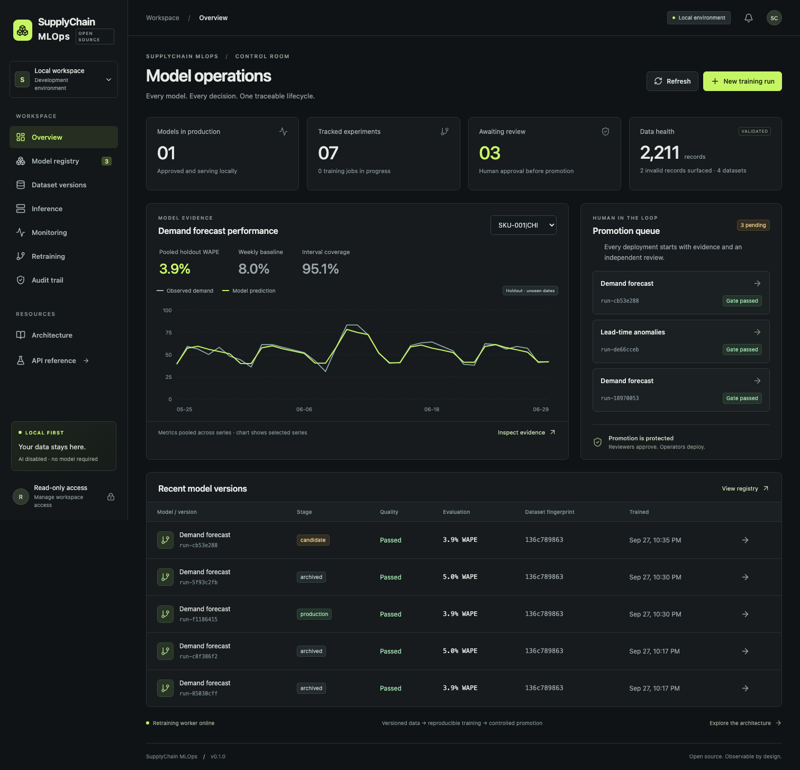
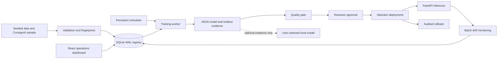

<div align="center">

# SupplyChain MLOps

### Your forecast passed the notebook. Can it survive production?

**An open-source MLOps platform for operational forecasting, risk and anomaly models.**

Train it. Trace it. Review it. Ship it. Roll it back.

[](LICENSE)
[](#run-it-locally)
[](#bring-your-own-local-model-or-none)

[Run the demo](#run-it-locally) · [Follow the lifecycle](#the-five-minute-workflow) · [Measured results](#numbers-you-can-reproduce) · [Architecture](docs/architecture.md) · [Repository tree](docs/repository-tree.md)

</div>



*A running local application, captured during the browser test. Every metric shown comes from the API and persisted model evidence. Screenshot state reflects the test workflow, not a promised first-run count.*

## The expensive part starts after training

A forecast becomes an operational liability when nobody can answer:

- Which dataset produced this model—and which rows were rejected?
- Did it beat the existing baseline on **future dates**?
- Who approved the model that is serving right now?
- Did supplier lead times shift, or did the prediction distribution change?
- Can we restore yesterday’s model and reproduce its exact output?

SupplyChain MLOps makes those questions executable. It is a **single-node model operations reference platform** for ML engineers, data scientists and platform engineers working on supply-chain systems. The repository includes real training, a transactional registry, inference, monitoring, a persistent retraining worker and an evidence-backed dashboard.

## The five-minute workflow

1. **Inspect the data.** Startup loads a seeded demand dataset, a shifted monitoring batch, a real ConsignAI synthetic sample, and an intentionally invalid fixture. Invalid records have a visible report and cannot enter training.
2. **Review a candidate.** The worker trains forecast and anomaly pipelines. Open the registry to inspect chronological holdout results, parameters, dataset fingerprints and the JSON artifact.
3. **Approve with a reviewer key.** A quality gate must pass. The training actor cannot approve its own candidate.
4. **Deploy with an operator key.** Generate a forecast from the approved version, then evaluate `drift.jsonl` in Monitoring.
5. **Prove recovery.** Train another forecast with ridge alpha `2`, approve and deploy it, then restore the archived first version. The browser test verifies that the restored predictions and artifact hash are exactly equal to the original.

**No model is automatically promoted. Scheduled retraining only creates candidates.**

## What makes this worth inspecting

| Capability | What actually happens |
|---|---|
| Reusable training pipelines | Per-SKU/location seasonal ridge forecasting and robust lead-time/fulfillment anomaly detection |
| Supply-chain semantics | Stockout-censored fitting/scoring, weekly baseline comparison, planned promotions, explicit SKU/location coverage |
| Experiment tracking | Seed, parameters, metrics, chronological boundaries, code hash, environment, artifacts and duration |
| Versioned datasets | Raw-file and canonical-record SHA-256 fingerprints, row provenance, visible rejection reports |
| Model registry | Candidate → approved → production → archived; immutable training evidence with controlled stage transitions |
| Deployment safety | Separate operator/reviewer roles, idempotent writes and compare-and-swap deployment updates |
| Drift monitoring | Smoothed histogram PSI, standardized mean shift and model-output distribution checks |
| Durable retraining | SQLite-backed schedules, atomic job claims, expired-lease recovery, bounded crash retries |
| Recovery | Rollback only to an approved, previously deployed version; audit evidence and exact-output verification |
| Optional local AI | Read-only evidence summaries through Ollama or a local OpenAI-compatible server; abstention on missing/invalid evidence |

## Run it locally

Prerequisite: a container engine with Docker Compose v2. Docker Engine on Linux, or Colima plus the Docker CLI on macOS, provides an open-source route. On Windows, use Docker Engine in WSL2 or an appropriate open-source desktop container environment. No paid credentials or AI service are needed.

```bash
git clone <your-fork-url>/supplychain-mlops.git
cd supplychain-mlops
cp .env.example .env
docker compose up --build
```

Open **[http://localhost:5188](http://localhost:5188)**. The API is at [http://localhost:8018/docs](http://localhost:8018/docs).

The first startup creates private local keys and two training jobs. The dashboard is readable immediately. To make changes:

```bash
docker compose exec api scml keys
```

Choose **Workspace access** and paste the required role key. Keys remain in browser memory; refreshing clears access. Keep the two keys separate when multiple people use the workspace. The local demo operator can access the state volume and is ultimately trusted.

Data survives restarts in the `operations` volume. `docker compose down` preserves it. Do not remove that volume if you need its history.

**Verification status:** native backend/frontend, browser lifecycle and benchmarks were run on macOS. Docker configuration is supplied and statically checked; container startup could not be run on the build machine because no container runtime was installed. The included CI workflow runs a real Compose smoke test. GitHub CI has not been run remotely because this delivery is local-only. See [release checklist](docs/release-checklist.md).

For Python/Node development, see [macOS, Linux and Windows instructions](docs/development.md).

## Architecture



The diagram shows logical data ownership; the dashboard reads and writes through FastAPI. Business logic lives in `packages/scml`, not in HTTP handlers or React components.

**Stack:** Python 3.12, NumPy, Pydantic, FastAPI, SQLite WAL, a persistent Python worker, React, TypeScript, Vite, Playwright, pytest and Docker Compose. This deliberately smaller implementation replaces MLflow/Prefect/PostgreSQL/object storage for the local path; it does **not** claim compatibility with their APIs. See [ADR 001](docs/adr/001-local-registry.md), [ADR 002](docs/adr/002-json-models.md) and [ADR 003](docs/adr/003-optional-local-ai.md).

## Numbers you can reproduce

Measured on **Apple M5**, macOS-26.6.2-arm64-arm-64bit, Python 3.12.14, NumPy 2.5.3; seed 42; **LLM disabled**. Five repeated fits on the small fixture.

| Dataset | Pipeline | Median fit | Holdout result |
|---|---|---:|---:|
| 720 observations · 4 series · 180 days | Forecast | 1.732 ms | 3.94% WAPE |
| Same fixture | Weekly baseline | — | 7.96% WAPE |
| Same fixture | Anomaly detector | 0.780 ms | 1.000 F1 |
| 14,600 observations · 40 series · 365 days | Forecast | 39.935 ms | 0.77% WAPE |

The small harness passed **10/10 assertions**: reproducibility and quality for both pipelines, dataset traceability, deployment API smoke, drift alerting, exact prediction/artifact rollback and rollback audit. These are small synthetic workloads and deliberately detectable anomalies. **They are not production accuracy or throughput claims.** Fit timings exclude ingestion; harness runtime and process peak RSS are reported separately.

```bash
python -m scml.evaluation.benchmark
python scripts/performance.py --series 40 --days 365 --repeats 3
```

Each command writes **JSON, CSV and Markdown** under `output/`. Inspect the committed [small result](docs/benchmarks/example/summary.md), [raw result](docs/benchmarks/example/results.json), [larger result](docs/benchmarks/performance/summary.md) and [evaluation methodology](docs/evaluation.md). Both result files record the actual runtime configuration and hardware metadata.

## Sample data with honest provenance

```bash
scml generate
python -m scml.data.generator --seed 73 --days 365 --series 40 --output output/large-demand.jsonl
python -m scml.data.generator --consignai data/upstream/consignai-mini.jsonl.gz --output output/consignai.jsonl
```

The ConsignAI sample is copied from the local Apache-2.0 project, with the original archive fingerprint and notices retained. Its adapter preserves source snapshot IDs and contributing usage IDs. Lead time comes from material metadata; fulfillment is a documented stock-availability proxy.

**DemandSense has not been created.** The demand fixture is this repository’s independently implemented generator, not an integration with DemandSense. [Data dictionary and provenance](data/README.md) explain this boundary, seeded anomalies, stockouts, schema and ground truth.

## API example

Find a validated dataset with `GET /api/v1/datasets`, then queue a run:

```bash
# Set OPERATOR_TOKEN from `scml keys`; never commit it.
curl -X POST http://localhost:8018/api/v1/training \
  -H "Authorization: Bearer $OPERATOR_TOKEN" \
  -H 'Idempotency-Key: training-demo-001' \
  -H 'Content-Type: application/json' \
  -d '{"dataset_id":"<dataset-id>","task":"forecast","seed":42,"ridge_alpha":1}'
```

Poll the returned job at `GET /api/v1/jobs/<job-id>`. Reviewer approval and operator deployment are separate endpoints. Model prediction responses include the serving version, dataset fingerprint and artifact hash. [API guide](docs/api.md) covers pagination, retries, consistent errors, uploads and rollback.

## Bring your own local model—or none

**AI is off by default. No model is selected, bundled, downloaded or required.** Forecasts, anomaly scores, monitoring, approvals, retraining and rollback all work without an LLM.

To opt in, configure a local endpoint in `.env`, set `SCML_LLM_ENABLED=true`, restart the API, and enter your installed model name in a model’s **Optional local AI explanation** panel. Use `ollama` for Ollama’s native API or `openai-compatible` for a local llama.cpp/vLLM server. The protocol name does not require an OpenAI account or service.

You choose the model and must review its weight license. Structured output support varies by runtime/model; unsupported responses cause abstention. Local narratives are labeled, cite evidence IDs and expose runtime/latency/validation telemetry. They cannot approve, deploy, execute shell commands or run SQL. [AI design and configuration](docs/ai-design.md).

## Tests, security and release honesty

```bash
pytest -q
ruff check packages apps/api tests scripts
cd apps/web
pnpm test
pnpm typecheck
pnpm lint
pnpm build
pnpm exec playwright install chromium
pnpm test:e2e
```

The browser suite uses an isolated state directory and real API/worker processes. It also refreshes the committed screenshots. See [screenshot instructions](docs/screenshots/README.md).

All exposed Compose ports bind to loopback. Mutations require role tokens and idempotency keys. Artifacts are JSON—not pickle. Uploads are bounded, typed and validated; filenames are sanitized and SQL values are parameterized. Logs include trace IDs and avoid tokens/input bodies. Read-only DB connections use SQLite query-only mode. [Threat model](docs/security.md) · [Vulnerability reporting](SECURITY.md).

## What this version does not claim

- No high availability, distributed training, multitenancy, SSO or external secret manager.
- The API paginates responses, but the small local JSON store still loads collections in memory; it is not a warehouse-scale implementation.
- Synthetic point forecasts and pooled empirical intervals are reference models, not demand-planning certification. No hierarchy reconciliation, lost-sales estimation or optimization of inventory decisions.
- Anomaly approval requires labeled holdout evidence. ConsignAI proxy measurements are unsuitable for claiming measured fulfillment performance.
- Drift is a distribution warning, not proof of accuracy degradation. Calendar-only forecasts can stay stable when observed demand changes.
- Schedules pin a dataset version; they do not silently ingest new data or auto-promote models.
- Local role keys demonstrate server-side boundaries, not tamper-proof separation from a machine administrator.
- Live local-model generation, Docker startup and remote GitHub CI remain explicitly unverified in this environment.

## The next five engineering improvements

1. **Rolling-origin evaluation and intermittent demand baselines** with segment-level scorecards and promotion policies that prevent pooled metrics from hiding weak SKUs.
2. **PostgreSQL + content-addressed object storage** with schema migrations, streaming ingestion, retention policies and SQL-level pagination.
3. **Champion/challenger shadow inference** with delayed actuals, forecast accuracy monitoring, deployment cohorts and reversible traffic switching.
4. **Workload-aware orchestration** with heartbeat-renewed leases, cancellation, bounded queues, resource quotas and integration with Prefect or Airflow.
5. **Independent identity and signed evidence** through OIDC, reviewer identities, artifact attestations and externally protected audit storage.

Details and acceptance criteria: [roadmap](docs/roadmap.md).

## Contribute

A useful contribution comes with a failure case, a reproducible experiment and a clear operational reason. Start with [CONTRIBUTING.md](CONTRIBUTING.md), review the [architecture](docs/architecture.md), and run the checks above. Ideas for new models are welcome; improvements to provenance, recovery and evaluation are equally valuable.

If this helps you move a supply-chain model beyond a notebook, **star the repository and share the failure mode you want to solve next.**

## License

Apache-2.0. Dependency and model-weight licenses remain their own. Material runtime, UI, test and container dependencies are documented in [open-source licenses](docs/open-source-licenses.md), with the ConsignAI source notices preserved. No model weights or proprietary datasets are distributed.
